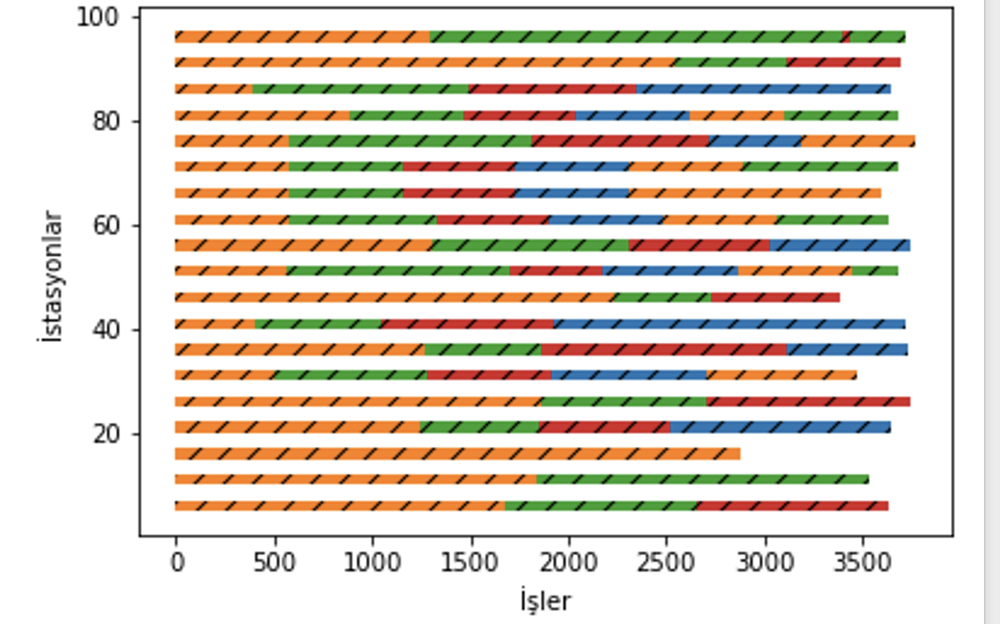

# Incorporating ergonomic risks into assembly line balancing

In manufacturing, control of ergonomic risks at manual workplaces is a necessity commanded by legis- lation, care for health of workers and economic considerations. Methods for estimating ergonomic risks of workplaces are integrated into production routines at most firms that use the assembly-type of produc- tion. Assembly line re-balancing, i.e., re-assignment of tasks to workers, is an effective and, in case that no additional workstations are required, inexpensive method to reduce ergonomic risks. In our article, we show that even though most ergonomic risk estimation methods involve nonlinear functions, they can be integrated into assembly line balancing techniques at low additional computational cost. Our compu- tational experiments indicate that re-balancing often leads to a substantial mitigation of ergonomic risks.

#  SUMMARY 

Optimizing the amount of product produced per unit time with the most effective and efficient use of available resources is of critical importance for firms in today's competitive business world. In line with this, assembly line balancing problems come to the forefront in order to ensure that a material entering the production system leaves the system with the least possible waiting time and lost time, and therefore with the most balanced work distribution and profit possible. One of the components or constraints of all these line balancing studies can be defined as ergonomics. Even if assembly lines designed with ergonomics factors in mind do not change profitability parameters such as task assignment to stations, number of stations and cycle time, they can significantly affect the level of ergonomic risks in workplaces. Furthermore, since better ergonomics can reduce the defect rate and days off due to illnesses, incorporating ergonomics into assembly line balancing systems will increase the profitability of production, albeit indirectly
## Occupational Repetitive Motion Index (OCRA)
The OCRA index is the first, most analytical and most reliable method developed. In the OCRA literature, it is the work done repetitively during the cycle time. It is often used for (re)design or in-depth analysis of workstations and tasks. The OCRA method is not suitable for production stages with a lot of lifting, lowering and transportation. It is more commonly used in automated material handling systems: where operators work around a conveyor moving at a constant speed. When calculating with the OCRA index, if more than one job is performed at the relevant station, the index is not calculated individually and separately for these jobs. It is sufficient to calculate a single OCRA value for the entire station. In the OCRA method, ergonomic examination of movements in the upper body can be performed. In particular, it is possible to interpret the work, posture and movements involving the basic upper body elements such as hands, wrists, elbows and shoulders with the OCRA index.
If the ocra index is less than 3.5, it is OK.

Recommended Frequency=OS*PM*FoM*RM*AdM

OS: Here the operating system specifies organization-specific parameters (e.g. the duration of the short cyclic activity within the shift). Under ergonomically optimal conditions for repetitive activities performed during an eight-hour shift, the OS achieves a best-case value of 18 repetitions per minute. In less ideal conditions, the value is reduced accordingly.

PM: PM is a multiplier for posture.

FoM: FoM is a force multiplier based on the average force exerted by the upper limbs.

RM: RM is a repetition multiplier that takes the value 0.7 if the cycle duration is less than 15 seconds and/or the same movements of the upper limbs are performed for more than 50% of the cycle duration, otherwise RM is equal to 1.

Adm: additional factors multiplier

## Dataset Description

number of tasks: Number of tasks

cycle time: Cycle time

task times: Times of tasks

average force:	Force value of tasks

frequency tasks:Frequency value of tasks

severe postures:Severe posture ratios for the task

mild postures: Mild posture ratios for the task

## Analysis of Assembly Line Balancing Outputs
The result of the calculation of the smoothness of the processing times of the workstations on the assembly line is called the smoothness index (SI) and is calculated as follows:

- 𝑆𝐼 : Uniformity index
- 𝑊𝑇max Maximum workstation duration
- 𝑊𝑇k.: Duration of the kth workstation
- 𝐾 : Sum of the number of stations
- 𝐶 : Cycle time
## Results
In manufacturing, the control of ergonomic risks in manual workplaces is a necessity dictated by legislation, occupational health and economic concerns. Methods for estimating ergonomic risks of workplaces are integrated into production routines in most companies using assembly-type production. Assembly line rebalancing, i.e. reassigning tasks to workers, is an effective and, if additional workstations are not required, inexpensive method to reduce ergonomic risks. In our paper we show that although most ergonomic risk estimation methods involve non-linear functions, they can be easily integrated

In all runs, the initial temperature in the algorithm was set to 0.9 and the minimum temperature was set to 0.

The following table analyzes the solutions for the first ten examples in the dataset
 

 sample Gant chart output:

  